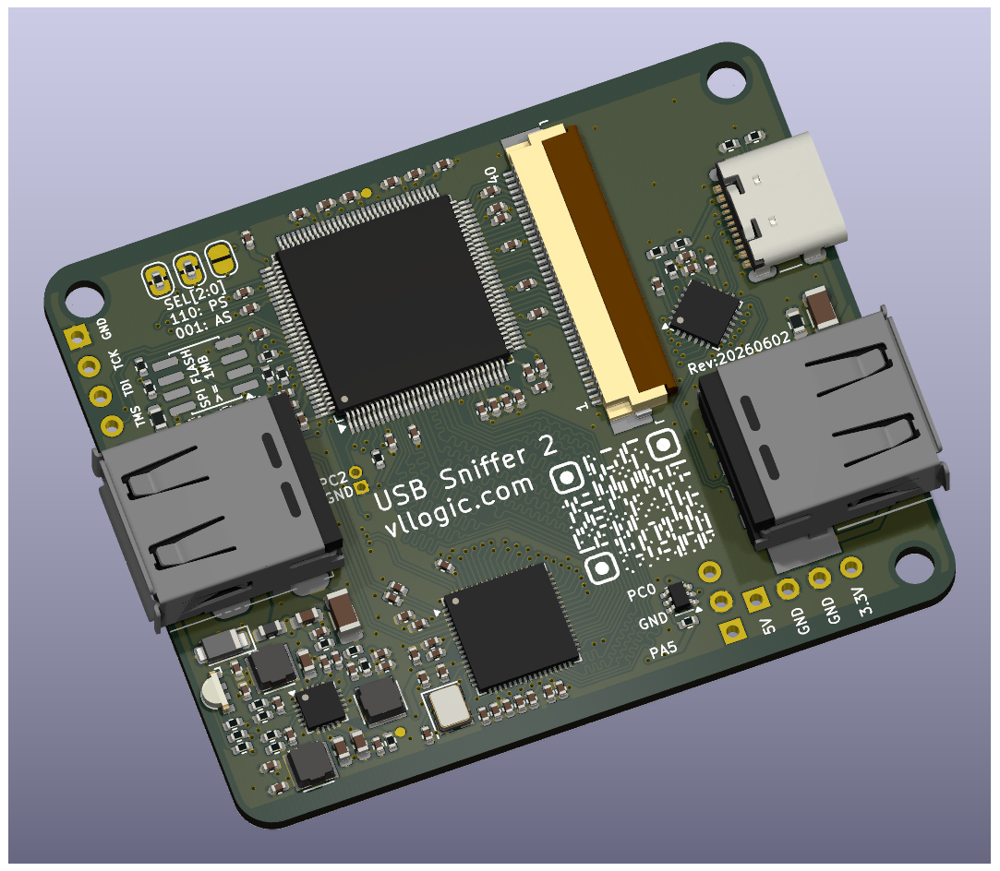
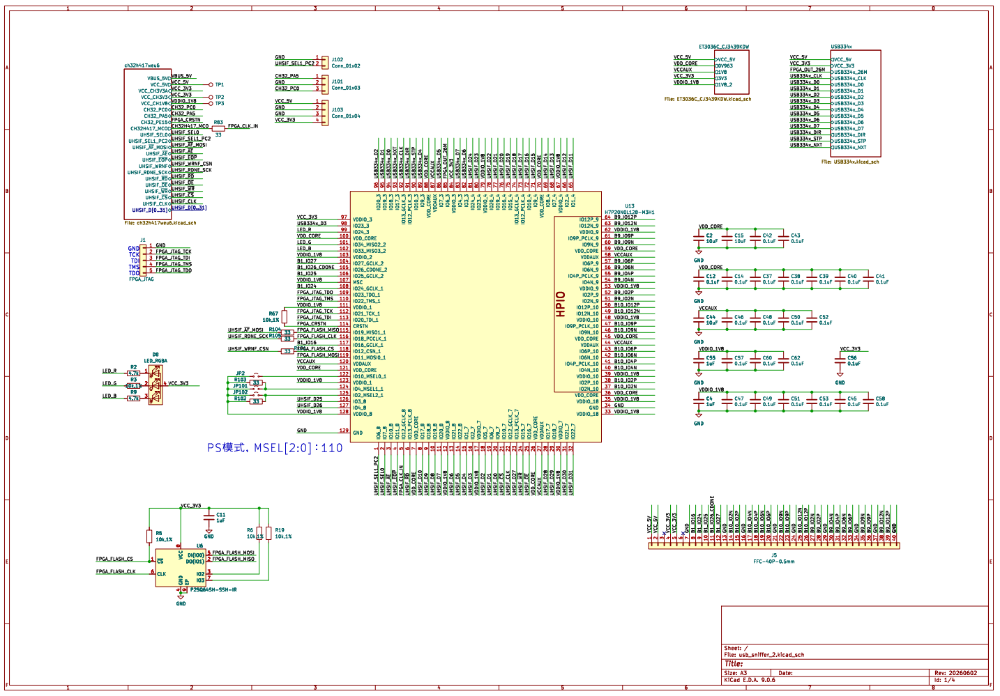

___
# English
# I. Introduction
* 
* Hardware design format: KiCad 9.0.6
* The CH32H417 serves as a USB 3.0 forwarder, with a unidirectional communication speed of up to 400MB/s, breaking the speed bottleneck of the 68013.
* 10 pairs of LVDS are broken out via an FFC connector, making it convenient to use as a USB 3.0 + FPGA expansion board.
* Default is PS mode, with reserved SPI FLASH pads. It supports adjustment to AS mode to facilitate secondary development.
# II. Main Components
1. [HME H7P20N0L128-M3H1](https://hercules-micro.com/index/index/core?id=16)
2. [WCH CH32H417WEU6](https://www.wch-ic.com/products/CH32H417.html)
3. [Microchip USB3343-CP-TR](https://www.microchip.com/en-us/product/usb3343)
# III. Schematic
* [Full PDF](https://www.google.com/search?q=./usb_sniffer_2.pdf)
___
# 中文
## 一、简介
* 
* 硬件图纸格式：Kicad 9.0.6
* CH32H417作为USB3.0转发器，单向通信速率可达400MB/S，解除68013的速率瓶颈
* 通过FFC连接器引出10对LVDS，方便作为USB3.0 + FPGA拓展板
* 默认PS模式，预留SPI FLASH焊盘，支持调整为AS模式，方便二次开发
## 二、主要器件
1. [HME H7P20N0L128-M3H1](https://hercules-micro.com/index/index/core?id=16)
2. [WCH CH32H417WEU6](https://www.wch-ic.com/products/CH32H417.html)
3. [Microchip USB3343-CP-TR](https://www.microchip.com/en-us/product/usb3343)
## 三、原理图
* 
* [完整PDF](./usb_sniffer_2.pdf)
___