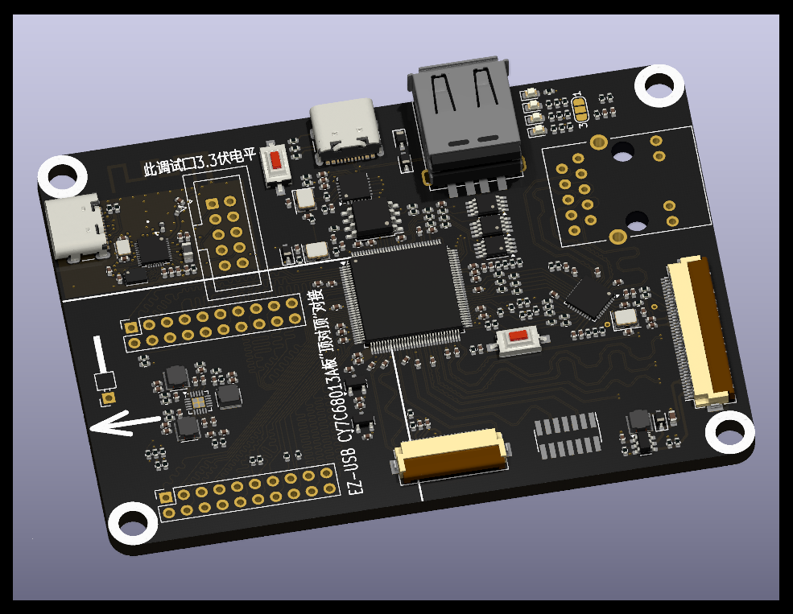

# 一、简介
#### &emsp;&emsp;大力神派是一款真●开源的FPGA开发板，在设计初期即以`Git`的方式公开项目进度及软硬件资料，期待与志同道合的同学们共同掌握FPGA应用方法，成长为全栈电子工程师。 
#### &emsp;&emsp;在五毛钱单片机大行其道的今天，大力神派完全摒弃简易外设，仅针对USB2.0高速、RGMII千兆以太网、MIPI1 三个应用方向。通过板载下载器、USB Sniffer等功能实现开发、工具两用化。
* [1] 硬件接口预留，需FPGA原厂提供Demo

# 二、重磅功能
#### &emsp;&emsp;下载器、开发板一体，割断JTAG相关短接点后，下载器可独立使用，支持京微齐力最新版本Fuxi及其绝大多数芯片
#### &emsp;&emsp;支持顶对顶连接20元包邮的`EZ-USB CY7A68013A板`，下载`ataradov.usb_sniffer`例程，即可变成USB2.0协议分析仪

# 三、板载芯片介绍
### [京微齐力 H7P20N0L128-M3H1](https://hercules-micro.com/index/index/core?id=16)
* 20K Logic cells
* LUT6架构
* 1152Kb EMB
* 内置ARM Cortex-M3 268MHz主频
* 2304KB SRAM
* 合封128Mb pSRAM
* LQFP128封装

### [爱科微 AIC8800FC](https://www.aicsemi.com/)
* 用于高速下载器/调试器
* 预留对外接口，限定3.3V电平

### YT8531C
* RGMII千兆PHY

### USB3343
* ULPI USB2.0高速PHY

# 四、接口介绍
### EZ-USB CY7A68013A对接口
* 用于连接EZ-USB CY7A68013A板，20元左右 [购买连接](https://item.taobao.com/item.htm?id=620955124878)

### MIPI DSI 40P连接器
* 用于连接5.0寸720*1280液晶显示屏，型号`D500C930SV0`带触摸，65元 [购买连接](https://item.taobao.com/item.htm?id=707705009617)
* 注意：MIPI接口当前仅预留，需后续开发支持

### MIPI CSI 24P连接器
* 用于连接OV5640 MIPI摄像头，规格`*-23AF`20元左右 [购买连接](https://item.taobao.com/item.htm?id=816198271497)
* 注意：MIPI接口当前仅预留，需后续开发支持

# 五、硬件
* 绘制中，尚未打样及测试

# 六、例程
* [详细说明](./examples/readme.md)

# 七、交流群
* QQ群：635683631
